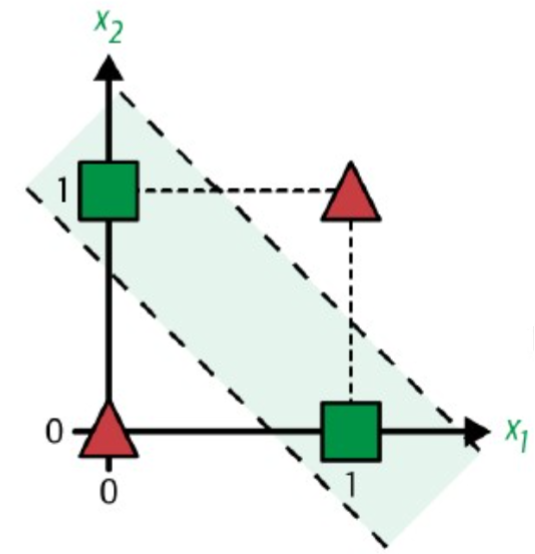
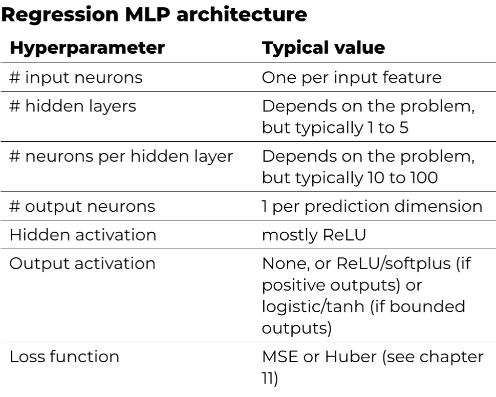
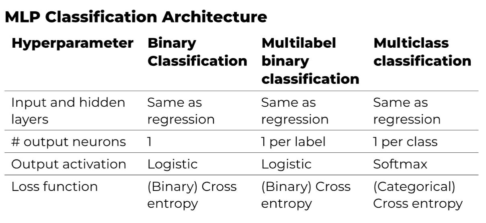

# Chapter 10

<link href="../style.css" rel="stylesheet"></link>

## 10.1 From Biological Neurons to Artificial Neurons

### 10.1.3 The Perceptron

Based on Threshold Logical Unit (TLU) (or SOMETIMES Linear Threshold Unit (LTU))

#### Threshold Logical Unit

Computes weighted sum of inputs:

$z = w_1x_1 + w_2x_2 + \dots + w_nx_n + b = \mathbf{w}^T\mathbf{x} + b$

Then applies step function to the sum:

$h_w(\mathbf{x}) = step(z)$

#### Step Functions

Typically the Heaviside step function:

$H(z) = \begin{cases} 0 & \text{if } z < 0 \\ 1 & \text{if } z \geq 0 \end{cases}$

#### Perceptron Architecture

Perceptron = single layer of TLU's with each TLU (or neuron) connected to all inputs.

All neurons connected to all neurons in previous layer = `Fully Connected Layer` or `Dense Layer`.

All input neurons = `Input Layer`.

#### Perceptron Computation

$h_w,_b(\mathbf{x}) = \phi(\mathbf{X}\mathbf{W} + b)$

- $\mathbf{X}$: matrix input features with shape **(num_instances, num_features)**
- $\mathbf{W}$: weight matrix with all connection weights, except bias with shape **(num_features, num_outputs)**
- $b$: bias vector, one bias per neuron with shape **(num_outputs,)**
- $\mathbf{X}\mathbf{W}$: dot product of the two matrixes
- $\phi$ is the **activation function** (Heaviside step function with TLU's).

##### Broadcasting

- $\mathbf{X}\mathbf{W}$ has shape **(num_instances, num_outputs)**.
- $b$ has shape **(num_outputs,)**.
- Not possible to add these two together.
- Solution: **Broadcasting** = adds $b$ to every row of $\mathbf{X}\mathbf{W}$.
- Activation function applied to each element of the resulting matrix.

#### XOR Problem

- Single layer of TLUs (Perceptron) can't solve XOR problem.



- Solution: Multi-layer Perceptron (MLP)


With: (1 = layer 1, 2 = layer 2)

- $\mathbf{W_1}$ = (2x2) matrix (2 inputs, 2 outputs)
- $\mathbf{W_1}$ = $\begin{vmatrix} 1 & 1  \\ 1 & 1\end{vmatrix}$
- $\mathbf{b_1}$ = $\begin{vmatrix} -3/2 \\ -1/2\end{vmatrix}$

- $\mathbf{W_2}$ = (2x1) matrix (2 inputs, 1 output)
- $\mathbf{W_2}$ = $\begin{vmatrix} -1 \\ 1\end{vmatrix}$
- $\mathbf{b_2}$ = $\begin{vmatrix} -1/2\end{vmatrix}$

- $\mathbf{X}$ = $\begin{vmatrix} 0 & 0 \\ 0 & 1 \\ 1 & 0 \\ 1 & 1\end{vmatrix}$

##### Layer 1

- $\mathbf{Z_1} = \mathbf{X}\mathbf{W_1} + \mathbf{b_1}$

- $\mathbf{Z_1} = \begin{vmatrix} 0 & 0 \\ 0 & 1 \\ 1 & 0 \\ 1 & 1\end{vmatrix} \begin{vmatrix} 1 & 1  \\ 1 & 1\end{vmatrix} + \begin{vmatrix} -3/2 \\ -1/2\end{vmatrix}$

- $\mathbf{Z_1} = \begin{vmatrix} -3/2 & -1/2 \\ -1/2 & 1/2 \\ -1/2 & 1/2 \\ 1/2 & 3/2\end{vmatrix}$

- $\mathbf{A_1} = \phi(\mathbf{Z_1})$ = everything $\geq$ 0 = 1, everything $<$ 0 = 0

- $\mathbf{A_1} = \begin{vmatrix} 0 & 0 \\ 0 & 1 \\ 0 & 1 \\ 1 & 1\end{vmatrix}$

##### Layer 2

- $\mathbf{Z_2} = \mathbf{A_1}\mathbf{W_2} + \mathbf{b_2}$

- $\mathbf{Z_2} = \begin{vmatrix} 0 & 0 \\ 0 & 1 \\ 0 & 1 \\ 1 & 1\end{vmatrix} \begin{vmatrix} -1 \\ 1\end{vmatrix} + \begin{vmatrix} -1/2\end{vmatrix}$

- $\mathbf{Z_2} = \begin{vmatrix} -1/2 \\ 1/2 \\ 1/2 \\ -1/2\end{vmatrix}$

- $\mathbf{A_2} = \phi(\mathbf{Z_2})$
- $\mathbf{A_2} = \begin{vmatrix} 0 \\ 1 \\ 1 \\ 0\end{vmatrix}$

- XOR problem solved! => $\mathbf{X} = \begin{vmatrix} 0 \oplus 0 \\ 0 \oplus 1 \\ 1 \oplus 0 \\ 1 \oplus 1\end{vmatrix}$ -> $\begin{vmatrix} 0 \\ 1 \\ 1 \\ 0\end{vmatrix}$ = $\mathbf{A_2}$

### 10.1.4 MLP and Backpropagation

- MLP = stacked perceptrons.
- Ouput of one layer is input of next layer.
- Neural network with many hidden layers = `Deep Neural Network`.
- MLP = `Feedforward Neural Network` = only flows in 1 direction.

Algorithm to train MLP = `Backpropagation`:

#### Forward Pass

- Minibatch passed to input layer -> first hidden layer
- Each layer computes weighted sum of inputs and applies activation function
- Output of last layer = $\hat{y}$ = prediction of network for input.
- Intermidiate results stored for backwars pass.

#### Backward Pass

- Measure error of network's output error (loss function compares $\hat{y}$ with $y$)
- Then computes how much each output connection contributed to error
- Then computes how much of these error contributions came from each connection in previous layer until input layer is reached.
- Then performs Gradient Descent step to tweak all connection weights in network using error gradients it just computed.
- Algoritm for backwards pass = `Reverse-mode autodiff`

#### Backpropagation Summary

- Backrpopagation -> predictions for minibatch (forward pass)
- Measures error
- Goes through each layer in reverse to measure error contribution frome each parameter (backward pass)
- Tweaks connection weights and biases (parameters) to reduce error (Gradient Descent step)

#### Activation Functions

- Gradient of Heaviside step function = 0 everywhere except at z = 0 -> Gradient Descent can't move -> not differentiable -> not usable.
- Replaced by `Logistic Function` or `Sigmoid Function`: differentiable function that has a similar shape and has non-zero derivative everywhere:
  - $\sigma(t) = \frac{1}{1 + e^{-t}}$
  - S-shaped curve between 0 and 1 -> outputs between 0 and 1 -> good for binary classification.

Other activation functions:

- `Hyperbolic tangent function (tanh)` = S-shaped, like sigmoid but outputs range from -1 to 1:
  - $tanh(z) = 2\sigma(2z) - 1$
  - Each layers output is centered around 0 -> often helps speed up convergence.

- `ReLU function` = most used activation function:
  - $ReLU(z) = max(0, z)$
  - Not differentiable at z = 0 -> Gradient Descent can't move -> in practice not an issue.
  - Very fast to compute -> training faster.
  - Doesn't have max output value

##### Why are activation functions needed?

- Linear combination of inputs = linear output
- final output = linear => whole model can be reduced to single layer
- => no complexity / can't solve complex problems
- => activation functions needed to introduce non-linearity

### 10.1.5 Regression MLPs



- Typically MSE as loss function but MAE is preferred if there are many outliers.
- Huber Loss is a combination of MSE and MAE, it is quadratic for small erros and linear for large erros.

### 10.1.6 Classification MLPs



#### Softmax Activation Function

$softmax(z_1, z_2, \dots, z_k) =$

1. $exp(z) = e^z$ for each $z$ => $(e^{z_1}, e^{z_2}, \dots, e^{z_k})$
2. Sum all these results => $Z = e^{z_1} + e^{z_2} + \dots + e^{z_k}$
3. Divide each $e^{z_i}$ by $Z$ => $softmax(z_1, z_2, \dots, z_k) = (\frac{e^{z_1}}{Z}, \frac{e^{z_2}}{Z}, \dots, \frac{e^{z_k}}{Z})$

#### Loss Functions

##### MSE Loss Function

$MSE = \frac{1}{m}\sum_{i=1}^{m}(\hat{y_i} - {y_i})^2$

With:

- $m$ = number of instances
- $\hat{y_i}$ = prediction for instance $i$
- $y_i$ = target for instance $i$

##### Huber Loss Function

$H(y, \hat{y}) = \begin{cases} \frac{1}{2}(y - \hat{y})^2 & \text{if } |y - \hat{y}| \leq 1 \\ |y - \hat{y}| - \frac{1}{2} & \text{otherwise} \end{cases}$

Huber loss also contains parameter $\delta$ that determines where function changes from quadratic to linear.
In the example above $\delta = 1$.

##### Binary Cross-Entropy

$BCE(y, \hat{y}) = -(ylog(\hat{y}) + (1 - y)log(1 - \hat{y}))$

With:

- $y$ = true label (0 or 1)

=> can be written as:

$BCE(y, \hat{y}) = \begin{cases} -log(\hat{y}) & \text{if } y = 1 \\ -log(1 - \hat{y}) & \text{if } y = 0 \end{cases}$

##### Categorical Cross-Entropy

$CCE(y, \hat{y}) = -\sum_{k=1}^{K}y_klog(\hat{y_k})$

With:

- $y_k$ = one-hot encoded vector of length $K$
- $\hat{y_k}$ = vector of length $K$ containing predicted probabilities for each class

## 10.2 Implementing MLPs with Keras

- List form or add() method with Sequential
- Inputlayer or add input_shape to first layer => input_shape DOES NOT include batch size
- Flatten() turns input into 1D array
- model.layers => list of layers
- layer[1].get_weights() => weights and biases of layer
- tf.keras.utils.to_categorical for one-hot encoding
- Concatenate layer -> concatenate([layer1, layer2]) LIST!

Functional API:

- Define layers
- Connect layers by calling them on one another
- Add layers to tf.keras.Model(inputs=[], outputs=)
- Note: input layer -> shape + type of input (default 32bit-float)
- E.g.:

```python
input_ = keras.layers.Input(shape=X_train.shape[1:])
hidden1 = keras.layers.Dense(30, activation="relu")(input_)
hidden2 = keras.layers.Dense(30, activation="relu")(hidden1)
concat = keras.layers.Concatenate()([input_, hidden2])
output = keras.layers.Dense(1)(concat)
model = keras.Model(inputs=[input_], outputs=[output])
```

Multiple inputs and outputs:
  
```python
input_A = keras.layers.Input(shape=[5], name="wide_input")
input_B = keras.layers.Input(shape=[6], name="deep_input")
hidden1 = keras.layers.Dense(30, activation="relu")(input_B)
hidden2 = keras.layers.Dense(30, activation="relu")(hidden1)
concat = keras.layers.concatenate([input_A, hidden2])
output = keras.layers.Dense(1, name="output")(concat)
aux_output = keras.layers.Dense(1, name="aux_output")(hidden2)
model = keras.Model(inputs=[input_A, input_B], outputs=[output, aux_output])

model.compile(loss=["mse", "mse"], loss_weights=[0.9, 0.1], optimizer="sgd")

# model.compile(loss={"output": "mse", "aux_output": "mse"}, loss_weights=[0.9, 0.1], optimizer="sgd")

# where loss_weights = relative importance of each output
```

Should also pass 2 training sets (one for each input) and 2 labels (one for each output):

With the predict -> you can get tuple of predictions:

```python
y_pred_tuple = model.predict((X_new_A, X_new_B))
y_pred = dict(zip(model.output_names, y_pred_tuple))
```

## 10.3 Fine-Tuning Neural Network Hyperparameters

### 10.3.1 Number of Hidden Layers

- many problems can be solved with 1 or 2 hidden layers
  - large image classification maybe 10 or more
- try increasing number of hidden layers until overfitting

### 10.3.2 Number of Neurons per Hidden Layer

- input and output layers = problem dependent
- hidden layers = typically same size
  - but sometimes 1st hidden layer larger than others
- try increasing number of neurons until overfitting
- `Stretch Pants` = Start with more layers and neurons than you need -> use early stopping and other regularization techniques to prevent overfitting

### 10.3.3 Learning Rate, Batch Size and Other Hyperparameters

#### Learning Rate

- Most important hyperparameter
- Start with small value -> gradually increase (multiply by constant factor at each iteration)

#### Batch Size

- Significant impact on training time and model performance
- Main advantage of large batchsize => hardware acceleration (GPU) can be used more efficiently
