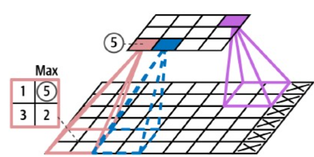
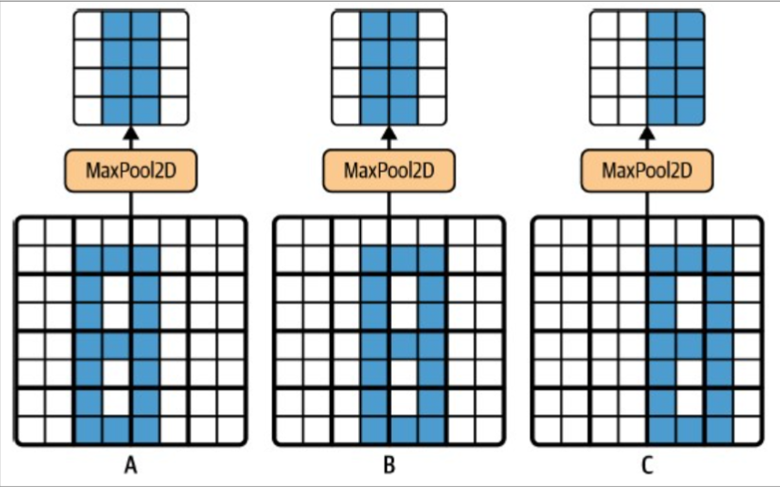
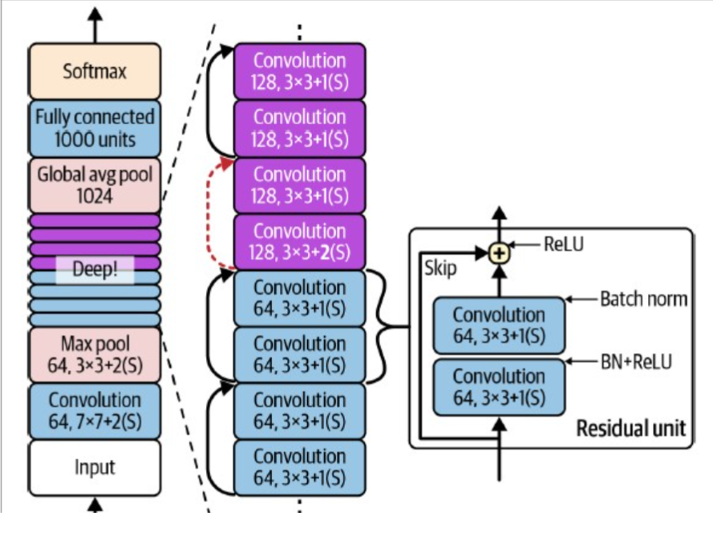
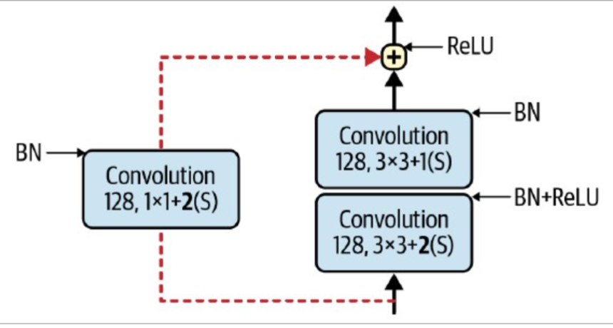

# H14: Deep Computer Vision Using Convolutional Neural Networks

<link href="../style.css" rel="stylesheet"></link>

## 14.1: Introduction to Convolutional Neural Networks

- CNN's can now outperform humans on some complex visiual tasks
  - Due to:
    - Large datasets
    - Better hardware
    - Better training techniques

## 14.2 Convolutional Layers

- Lower layers detect simple features
- Higher layers detect more complex features
- Each layer presented in 2 (spatial) dimensions
- Zero padding to ensure output of a particular layer has same size as input
- `Stride`: number of pixels the filter shifts each time
- Any image size can be used as input
  - as long as image size is greater than filter size
  - and images have right number of channels

### 14.2.1 Filters

- Weights of neuron = `Filter` or `Kernel`
- Filters are learned during training

`Feature map`:

- output of conv layer
- all neurons share same weights and bias
- -> reduces number of parameters
  - Once CNN learns to detect a pattern in one part of image, it can detect it anywhere

<br>

- In practice: `multiple filters` per layer
- Output of each filter = feature map -> conv layer outputs stack of feature maps (3D tensor)
- One neuron per pixel in feature map
- Neuron's receptive field `extends across all feature maps` of previous layer

### 14.2.3 Implementing Convolutional Layers with Keras

- Shape of input (image) = `(batchsize, height, width, channels)` -> 4D tensor
  - Channels = 1 for grayscale, 3 for RGB

- `tf.keras.layers.Conv2D`:
  - `filters`: number of filters
  - `kernel_size`: size of filter
  - `strides`: default = 1
  - `padding`: default = 'valid'
  - `activation`: default = None

```python
tf.keras.layers.Conv2D(filters=32, kernel_size=7)
```

- input_shape = (2, 70, 120, 3)
- Output will be (2, 64, 114, 32) (batchsize, height (of featuremap), width (of featuremap), filters)

`Valid padding`:

- Receptive field of neuron is contained within input
- Output smaller than input, some pixels are lost
- n - f + 1 x n - f + 1
- e.g. 6x6 input, 3x3 filter
  - n = 6, f = 3 -> output = 4x4

`Same padding`:

- Output same size as input
- Zero padding added to input
- n + 2p - f + 1 x n + 2p - f + 1
- <=> p = (f - 1) / 2
- e.g. 6x6 input, 3x3 filter
  - n = 6, f = 3 -> p = 1 -> output = 6 + 2 - 2 x 6 + 2 - 2 = 6x6

`Strides`:

- Default = 1
- Higher stride -> smaller output
- Stride = 2 -> output half size of input
- padding -> floor((n + 2p - f / s) + 1) x floor((n + 2p - f / s) + 1)

`Activation`:

- Default = None
- -> CNN performs linear transformation -> activation needed
- -> also specify kernel initializer

`Parameter computation and memory usage`:

- Number of parameters in conv layer = (filter_height \* filter_width \* input_channels + 1) \* number_of_filters
- E.g.
  - 5x5 filter
  - 3 input channels
  - 200 filters
  - Image size = 150x100
  - -> (5x5x3 + 1) x 200 = 15.200 parameters
- Number of floating point computations
  - 200 feature maps of 150x100
  - each neuron -> 5x5x3 = 75 multiplications
  - Total multiplications = 200 x 150 x 100 x 75 = 225.000.000
  - Memory needed (float32 = 4 bytes)
    - 200x150x100x4 = 12.000.000 bytes = 12 MB per image

During training:

- Each layers keeps outputs in memory -> backpropagation
- During inference -> layer can discard output after it has been used by next layer
- => `only RAM required by 2 consecutive layers`

## 14.3 Pooling Layers

- Subsample original images
  - reduce computational load
  - reduce memory usage
  - reduce number of parameters -> reduce risk of overfitting
- Must define:
  - Size of pooling window
  - Stride
  - Padding
- Has no weights
  - no training needed
  - simply aggregates (summarizes) values of neurons in its receptive field

### Max pooling

- Most common
- Returns max value of neurons in its receptive field


<br>
Maxpooling with 2x2 kernel, stride 2, no padding (valid)

`Translation Invariance`:



`Disadvantages`:

- Removes a lot of information (e.g. kernel 2x2 and stride 2 -> 75% of information lost)
- Translation invariance can be a problem
  - E.g. for semantic segmentation

## 14.4 Implementing Pooling Layers with Keras

```python
max_pool = tf.keras.layers.MaxPool2D(pool_size=2)
```

- Above:
  - 2x2 kernel
  - stride 2
  - no padding (valid)

```python
global_avg_pool = tf.keras.layers.GlobalAvgPool2D()
```

- Above:
  - mean of each entire feature map (= avg_pool with kernel size = feature map size)
  - very destructive
  - typically used just before output layer

## 14.5 CNN Architectures

Typical CNN architecture:

- Conv layers
- Pooling layers
- Conv layers
- Pooling layers
- Fully connected layers

Images get smaller as they pass through network -> but number of filters increases (i.e. deeper)

Make sure to Flatten() before passing to fully connected layers

### 14.5.1 LeNet-5

- Similar to typical CNN architecture
- tanh activation function instead of ReLU
- RBF (radial basis function) instead of softmax

### 14.5.2 AlexNet

Regularization techniques

`Dropout`: of 50% after the fully connected layers (after F9 and F10)

`Data augmentation`:

- Randomly cropping, flipping training images
- Randomly changing brightness and contrast
- -> increase size of training set
- -> make model more tolerant to variantions
- Synthetic Minority Oversampling Technique (`SMOTE`)
  - Oversample minority class

`Local response normalization`:

- Most strongly activated neurons inhibit other neurons located at same position in neighboring feature maps
  - such behavior observed in biological neurons
  - encourages features maps to specialize

- Formula:

$b_i = a_i (k + \alpha \sum_{j=max(0, i-r/2)}^{min(f_n-1, i+r/2)} (a_j)^2) ^-\beta$

Where:

- $b_i$ = normalized output for neuron in feature map $i$
- $a_i, a_j$ = activations of nearons in feature map $i$ and $j$
- $k, \alpha, \beta, r$ = hyperparameters ($k$ = bias, $r$ = depth radius)
- $f_n$ = number of feature maps

In AlexNet:

- LRN used after ReLU step of C1 and C3
- `tf.nn.local_response_normalization` to use LRN in Keras (can be wrapped in `tf.keras.layers.Lambda`)

### 14.5.5 ResNet or Residual Network

- 152 layers -> Key to training such model = `Skip connections`

`Skip connections`: zie video: <https://www.youtube.com/watch?v=RYth6EbBUqM&list=PLkDaE6sCZn6Gl29AoE31iwdVwSG-KnDzF&index=15>

- **Main aim of NN:**
  - Learn and represent a target function $h(x)$

- **Residual Learning:**
  - Instead of directly modeling $h(x)$, the NN learns the difference $f(x) = h(x) - x$
  - Focuses on learning the "residual" or the part needed to add to $x$ to approach $h(x)$

- **Skip Connection:**
  - Also known as a residual connection
  - Directly connects the output of an earlier layer to the input of a later layer
  - Even if layer does not learn -> NN can still keep learning
  - Output of the residual block is $f(x) + x$, equivalent to $h(x)$
  - NN learns to drive the output of the residual block towards zero, effectively modeling $h(x)$

- **Residual Unit:**
  - Residual block with 2 layers
  - First layer: 3x3 conv layer, stride 1, BatchNorm, ReLU, padding=same
  - Second layer: 3x3 conv layer, stride 1, BatchNorm, padding=same
  - Second layer has same number of filters as first layer
  - Skip connection to output
  - Output: ReLU



- L1 and L2: Dividing image with and height by 4 (2 per layer)
  - reduce computational load
  - L1 -> large kernel size to preserver information
- Number of feature maps doubled every few residual units
- Spatial dimensions halved every few residual units (stride 2)
- => this is problem for skip connections
  - Solution: add a 1x1 conv layer with stride 2 to skip connection
  - -> ensures dimensions of skip connection match dimensions of output of residual unit



## 14.6 Implementing a ResNet-34 CNN with Keras

```python
from functools import partial

DefaultConv2D = partial(tf.keras.layers.Conv2D, kernel_size=3, strides=1, padding="same", kernel_initializer="he_normal", use_bias=False)

class ResidualUnit(tf.keras.layers.Layer):
    def __init__(self, filters, strides=1, activation="relu", **kwargs):
        super().__init__(**kwargs)
        self.activation = tf.keras.activations.get(activation)
        self.main_layers = [
           DefaultConv2D(filters, strides=strides),
            tf.keras.layers.BatchNormalization(),
            self.activation,
            DefaultConv2D(filters),
            tf.keras.layers.BatchNormalization()]
        self.skip_layers = []
        if strides > 1:
            self.skip_layers = [
                DefaultConv2D(filters, kernel_size=1, strides=strides),
                tf.keras.layers.BatchNormalization()]


    def call(self, inputs):
        Z = inputs
        for layer in self.main_layers:
            Z = layer(Z)
        skip_Z = inputs
        for layer in self.skip_layers:
            skip_Z = layer(skip_Z)
        return self.activation(Z + skip_Z)
```

```python
model = tf.keras.models.Sequential([
    DefaultConv2D(64, kernel_size=7, strides=2, input_shape=[224, 224, 3]),
    tf.keras.layers.BatchNormalization(),
    tf.keras.layers.Activation("relu"),
    tf.keras.layers.MaxPool2D(pool_size=3, strides=2, padding="same"),
])

prev_filters = 64
for filters in [64] * 3 + [128] * 4 + [256] * 6 + [512] * 3:
    strides = 1 if filters == prev_filters else 2
    model.add(ResidualUnit(filters, strides=strides))
    prev_filters = filters

model.add(tf.keras.layers.GlobalAvgPool2D())
model.add(tf.keras.layers.Flatten())
model.add(tf.keras.layers.Dense(10, activation="softmax"))
```

## 14.7 Using Pretrained Models from Keras

- `tf.keras.applications` module contains many pretrained models
- `tf.keras.applications.resnet50.preprocess_input`
- `tf.keras.applications.resnet50.decode_predictions`

```python
model = tf.keras.applications.resnet50.ResNet50(weights="imagenet")

img = load_sample_images()["images"]
img_resized = tf.keras.layers.Resizing(224, 224, crop_to_aspect_ratio=True)(img)

inputs = tf.keras.applications.resnet50.preprocess_input(img_resized)

Y_proba = model.predict(inputs)
Y_proba.shape # (2, 1000)

top_K = tf.keras.applications.resnet50.decode_predictions(Y_proba, top=3)

for image_index in range(len(img)):
    print(f"Image #{image_index}")
    for class_id, name, y_proba in top_K[image_index]:
        print(f" {calss_id} - {name:12s} {y_proba:.2%}")
```

## 14.8 Pretrained Models for Transfer Learning

`Load dataset`:

```python
import tensorflow_datasets as tfds

dataset, info = tfds.load("tf_flowers", as_supervised=True, with_info=True)
dataset_size = info.splits["train"].num_examples # 3670
class_names = info.features["label"].names # ['dandelion', 'daisy', 'tulips', 'sunflowers', 'roses']
n_classes = info.features["label"].num_classes # 5
```

`Split dataset`:

```python
test_set_raw, valid_set_raw, train_set_raw = tfds.load(
    "tf_flowers",
    split=["train[:10%]", "train[10%:25%]", "train[25%:]"],
    as_supervised=True)
```

`Preprocess dataset`:

```python
batch_size = 32
# Resize and preprocess pipeline
preprocess = tf.keras.Sequential([
    tf.keras.layers.Resizing(224, 224, crop_to_aspect_ratio=True),
    tf.keras.layers.Lambda(
      tf.keras.applications.xception.preprocess_input
    )
])

# Apply pipeline to dataset using map
train_set = train_set_raw.map(lambda X, y: (preprocess(X), y))
train_set = train_set.shuffle(1000, seed=42).batch(batch_size).prefetch(1)
valid_set = valid_set_raw.map(lambda X, y: (preprocess(X), y))
valid_set = valid_set.batch(batch_size)
test_set = test_set_raw.map(lambda X, y: (preprocess(X), y))
test_set = test_set.batch(batch_size)
```

```python
data_augmentation = tf.keras.Sequential([
    tf.keras.layers.RandomFlip(mode="horizontal", seed=42),
    tf.keras.layers.RandomRotation(factor=0.05, seed=42),
    tf.keras.layers.RandomContrast(factor=0.2, seed=42),
])
```

`Load pretrained model`:

```Python
input_ = tf.keras.layers.Input(shape=[224, 224, 3])
augmented = data_augmentation(input_)
base_model = tf.keras.applications.xception.Xception(weights="imagenet", include_top=False)
base_model_output = base_model(augmented)
avg = tf.keras.layers.GlobalAveragePooling2D()(base_model_output)
output = tf.keras.layers.Dense(n_classes, activation="softmax")(avg)
model = tf.keras.Model(inputs=[input_], outputs=[output])
```

`Freeze the Weights`:

```python
for layer in base_model.layers:
    layer.trainable = False
```

`After training unfreeze some layers`:

```python
for layer in base_model.layers[56:]:
    layer.trainable = True

# Compile and train -> Smaller learning rate
```

## 14.9 Classification and Localization

- `Object localization`: Regression task to predict bounding box around object
  - predict horizontal and vertical coordinates of object's center
  - predict height and width of bounding box
  - -> predict 4 numbers

- `Changes to model`:
  - Second Dense output layer (4 units)
    - typically on top of GlobalAvgPool2D layer
    - trained with MSE loss

```python
base_model = tf.keras.applications.xception.Xception(weights="imagenet", include_top=False)
avg = tf.keras.layers.GlobalAveragePooling2D()(base_model.output)
class_output = tf.keras.layers.Dense(n_classes, activation="softmax")(avg)
loc_output = tf.keras.layers.Dense(4)(avg)
model = tf.keras.Model(inputs=[input_], outputs=[class_output, loc_output])

optimizer = tf.keras.optimizers.SGD(learning_rate=0.2, momentum=0.9)

model.compile(loss=["sparse_categorical_crossentropy", "mse"], loss_weights=[0.8, 0.2], optimizer=optimizer, metrics=["accuracy"])
```

`Bounding boxes`:

- Should be normalized (height, width, hor coords, vert coords, between 0 and 1)
- Typically square root of height and width -> small deviations matter more for small boxes (higher loss)

`Intersection over Union (IoU)`:

- MSE loss not good metric for evaluating the model
- `tf.keras.metrics.MeanIoU` -> better metric
- IoU = most common metric for object localization
  - Area of overlap (intersection) of the actual and predicted bounding box devided by area of their union
  - If bounding boxes don't overlap -> IoU = 0
  - If bounding boxes are identical -> IoU = 1


## 14.10 Object Detection

`Object detection`: task of classifying and localizing multiple objects in an image

- Old approach: `sliding window`
  - Slide window across image
  - For each window -> predict class and bounding box
  - -> very slow
  - -> same object detected multiple times
  - Solution for multiple detections: `Non-max suppression`:
    - Remove all boxes with low confidence
    - Pick box with highest confidence
    - Remove all boxes that overlap with it (e.g. IoU > 0.5)
    - Repeat until no more boxes to remove

### 14.10.1 Fully Convolutional Network (FCN)

- Up until now -> CNN + fully connected layers at end
- Replace Dense layers with Conv layers -> `Fully Convolutional Network`

#### Example

- Dense layer with 200 units
- Input to Dense layer = flattened feature map with 7x7x100
- Each of 200 units computes weighted sum + bias of 7x7x100 = 4900 activations in feature map

<br>

- Conv layer with 200 filters
- kernel size = 7x7 (same as spatial dimensions of feature map)
- "valid" padding
- Each of 200 filters computes weighted sum + bias of 7x7x100 = 4900 activations in feature map

##### Only difference

- Dense output = (batch_size, 200)
- Conv output = (batch_size, 1, 1, 200)

##### Advantage of Conv layer (and pooling layer)

- Can be applied to any size of input image while Dense layer requires fixed size input

### 14.10.2 YOLO

- `YOLO`: You Only Look Once
- Object detection architecture
- Very fast (real time on video)
- 2 bounding boxes per grid cell -> detect two objects per grid cell

## 14.12 Semantic Segmentation

`Semantic segmentation`:

- Each pixel in the image is classified according to the class it belongs to
- But no distinction between instances of same class (e.g. 2 cars in image -> both classified as car)

`Instance segmentation`:

- Objects of the same class are not merged but are distinguished from each other
- (e.g. 2 cars in image -> both classified as car, but distinguished from each other by brand, color, etc.)
- Mask R-CNN is a popular architecture for instance segmentation
