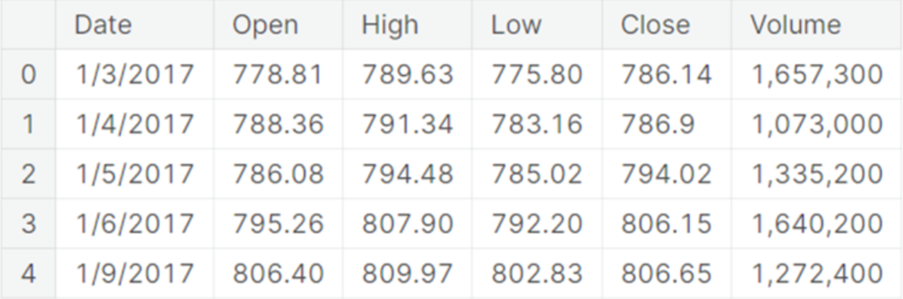
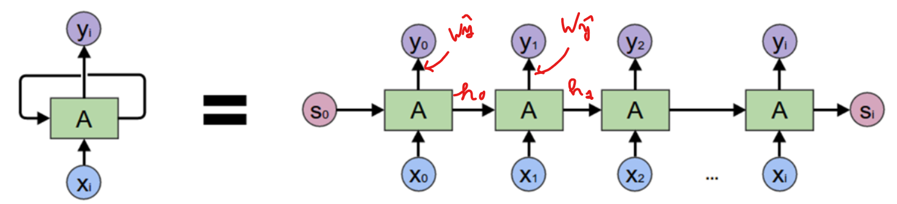

# Theoretical Questions

## 1. Can you think of a few applications for a sequence-to-sequence RNN? What about a sequence-to-vector RNN and a vector-to-sequence RNN?

`Sequence-to-Sequence RNN`:

```Text
Time series forecasting where input sequence length is the same as the output sequence length. E.g. The price of bitcoin from 14 days ago, predict price for the next 14 days
```

`Sequence-to-Vector RNN`:

```Text
Movie review sentiment analysis: Determine per movie review whether it is a positive or negative review
```

`Vector-to-Sequence RNN`:

```Text
Image captioning
```

## 2. How many dimensions must the inputs of an RNN layer have? What does each dimension represent? What about its outputs?

- How many dimensions: 3
- Representation of each dimension: (batch_size, number_of_timesteps, number_of_features)
- Outputs: (batch_size, number_of_timesteps, number_of_units_in_RNN)

## 3. If you want to build a deep sequence-to-sequence RNN, which RNN layers should have return_sequences=True? What about a sequence-to-vector RNN?

- All of the RNN layers
- All RNN layers except the last

## 4. Which neural network architecture could you use to classify videos?

- RNN or Conv1D with kernelsize 1 with each frame of the video as a timestep (if we don't take sound into account)
  - then have a Dense layer as output with 1 neuron

## 5. How do we create train/val/test sets for time series data? Explain the difference with a "standard" train/val/test split

- We don't shuffle the data in order to keep the order of timesteps, which is an important aspect of time series. With standard splitting, you can shuffle the data because the order is of little to no importance.

## 6. What is "Layer Normalization"? How does it work? What are the learnable parameters? How does layer norm compare to batch norm? How does it compare to the Normalization Layer?

- Normalization across the feature dimension
- Layer norm learns scale and offset per input feature
- Offset and scale
- Batch norm normalizes per batch, Layer norm per input feature
- Normalization layer normalizes all data before training, Layer Norm does it per layer

## 7. Answer following questions about code below

```Python
layer = tf.keras.layers.SimpleRNN(32, return_sequences=True, input_shape=[None, 5])
```

- What is the shape of the inputs? Indicate which dimensions are "fixed" and which my possibly vary.
  - (batch_size, number_of_timesteps, 5)
  - batch_size and number_of_timesteps will stay fixed throughout the model, 5 or the number of feature can/might/will be different at the outputlayer
- What is the shape of the outputs? Explain how the input shape determines the output shape.
  - (batch_size, number_of_timesteps, 32)
  - batch_size and number_of_timesteps will be the same from input to output
- Which activation is used?
  - tanh
- How many parameters does this layer have? Explain how the number of parameters is computed.
  - 32 \* 32 + 32 \* 5 + 32 \* 1 = 1216
  - (units \* units) = recurrent weights
  - \+ (units \* number_of_features) = input weights
  - \+ (1 \* units) = bias

## 8. What type of layers are used in WaveNet? What type of padding is used? How does this padding differ frome "same" padding? What is the purpose of this padding?

- Conv1D Layers
- causal padding
- Works the same as "same" padding but only adds padding to the left
- It does this to prevent the model from "looking in the future"

## 9. Suppose we want to predict the Google "Close" stock price for the next day using the following data



- Which column(s) are you going to drop?
  - Open, High, Low, Volume
- Which column(s) are you going to use as input features?
  - Date, Close
- Is this a univariate or a multivariate timeseries?
  - Multivariate
- If we only want to predict the Close price at the end, you should use a:
  - Sequence-to-vector network
- If we only want to predict the Close price, can we use a layer having multiple recurrent neurons, or should I use only 1 recurrent neuron because we only have 1 output value?
  - We can use layer with multiple recurrent neurons if we want to predict for x amount of days in the future, not just the next day (e.g. 5 neurons for 5 amount of days in the future)
- In the book, the following equations are shown to calculate the output values of a layer recurrent neurons for all instances in a pass $\hat{Y}_{(t)} = \phi(X_{(t)} \cdot W_{x} + \hat{Y}_{(t-1)} \cdot W_{\hat{y}} + b)$, suppose batch_size = 64
  - $X_{(t)}$ = Input batch at time step t, shape = (64, n_timesteps, n_features)
  - $\hat{Y}_{(t-1)}$ = Ouput of step t-1, shape = (64, n_timesteps, n_neurons)
  - $W_{x}$ = Weight matrix for input $X_{(t)}$, shape = (n_features, n_neurons)
  - $W_{\hat{y}}$ = Weight matrix for output of step t-1, shape = (n_neurons, n_neurons)
  - $b$ = bias term, shape = (n_neurons,)

## 10. A cell's hidden state and its output may be different. Indicate this on the figure



- h0, h1, etc... -> hidden state vectors
- y0, y1, etc... -> outputs calculated with the $W_{\hat{y}}$

## 11. In the book they give the example of trying to predict the occupancy ontrain and/or bus for the next day based on data from the past 8 weeks (56days). They use the following features

| date | day_type | bus | rail |
| ---- | -------- | --- | ---- |
| 2001-01-01 | U | 297192 | 126455 |
| 2001-01-02 | W | 780827 | 501952 |
| 2001-01-03 | W | 824923 | 536432 |
| 2001-01-04 | W | 870021 | 550011 |
| 2001-01-05 | W | 890426 | 557917 |

Following architecture:

```Python
model1 = tf.keras.Sequential([
  tf.keras.layers.SimpleRNN(1, input_shape=[None, 1])
])
```

Answer following questions:

- How many parameters does this model have?
  - 1 \* 1 + 1 \* 1 + 1 = 3
- How many rec layers?
  - 1
- How many input features?
  - 1

Next architecture:

```Python
model2 = tf.keras.Sequential([
  tf.keras.layers.SimpleRNN(32, input_shape=[None, 1]),
  tf.keras.layers.Dense(1) # no activation function by default
])
```

Answer following questions:
  
- How many parameters does this model have?
  - 32 \* 32 + 1 \* 32 + 1 \* 32 = 1088
  - 1 * 32 + 1 = 33
  - total = 1121
- How many rec layers?
  - 1
- How many input features?
  - 1
- Was adding Dense Layer necessary? Yes, RNN -> outputs sequence of hidden states (32 in this e.g.) and we only need 1 prediction (1 for the next day)

Next architecture:

```Python
model3 = tf.keras.Sequential([
  tf.keras.layers.SimpleRNN(32, return_sequences=True, input_shape=[None, 1]),
  tf.keras.layers.SimpleRNN(32, return_sequences=True),
  tf.keras.layers.SimpleRNN(32),
  tf.keras.layers.Dense(1) # no activation function by default
])
```

Answer following questions:
  
- How many parameters does this model have?
  - 32 \* 32 + 1 \* 32 + 1 \* 32 = 1088
  - 32 \* 32 + 32 \*32 + 1 \* 32 = 2080
  - 32 \* 32 + 32 \*32 + 1 \* 32 = 2080
  - 1 * 32 + 1 = 33
  - total = 5281
- How many rec layers?
  - 3
- How many input features?
  - 1
- Why is return_sequences=True added to first and second layer and not to the third?
  - because this is a sequence to vector model
- All models are examples of [univariate] / multivariate models ?
  - univariate because there is only 1 input feature
- Code for model2 if it were to change to multivariate:

```Python
model2 = tf.keras.Sequential([
  tf.keras.layers.SimpleRNN(32, input_shape=[None, NUMBER_OF_FEATURES]),
  tf.keras.layers.Dense(1) # no activation function by default
])
```

- model1, model2 and model3 are all examples of:
  - sequence-to-vector models
- Instead of predicting the next day, predict next 7 days, give the code for model2

```Python
model2 = tf.keras.Sequential([
  tf.keras.layers.SimpleRNN(32, input_shape=[None, 1]),
  tf.keras.layers.Dense(7) # no activation function by default
])
```

- In this way, model2 is a:
  - Sequence-to-vector model
- Instead of having the model make forecast for last 7 days at very end, we can change model so that it makes forecast for next 7 days at each time step:
  
```Python
model2 = tf.keras.Sequential([
  tf.keras.layers.SimpleRNN(32, return_sequences=True, input_shape=[None, 1]),
  tf.keras.layers.Dense(7) # no activation function by default
])
```

- In this way, model2 is a:
  - sequence-to-sequence model
