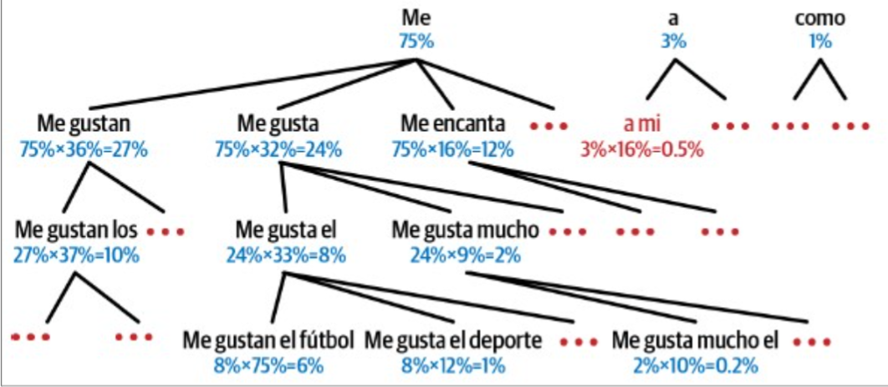
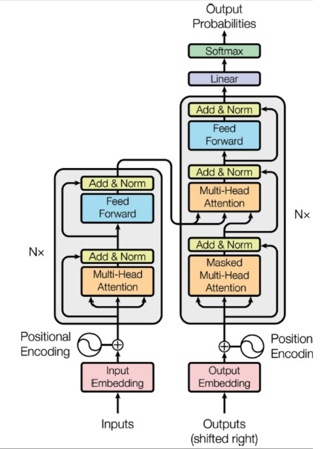

# H16: Natural Language Processing with RNNs and Attention

## 16.1: Generating Shakespearean Text Using a Character RNN

`Embedding layer`:

- input: (batch_size, sequence_length) (or window_length)
- input dimension: number of tokens / characters in vocabulary
- output: (batch_size, sequence_length, embedding_dimension) (embedding_dimension or output_dim)

`Greedy Decoding`:

- predict the most likely next character
- leads to repetitive text
- -> better to use categorical -> sample random class indices given class `log probabilities (logits)`
- `tf.random.categorical(logits, num_samples=1)` -> logits should be [[0.5, 0.2, 0.1]] -> in batches (double square brackets!) (numbers are just examples)

`Temperature`:

- Number we devide logits by before computing softmax
- Higher temperature -> more random
- Lower temperature -> more greedy (more likely to pick most likely class)

`Other sampling methods`:

- sample from top k classes
- from set of top classes whose total probability is at least p (nucleus sampling)
- beam search: keep track of k most likely sequences (see later)

## 16.2: Sentiment Analysis

- Sentiment classification of IMDb dataset (movie pos or neg): Hello world of NLP

`Tokenizing`:

- Split words on spaces
  - won't work for certain languages (chinese, german, ...)
  - even in English it's not perfect

=> `Byte Pair Encoding (BPE)`: tokenization algorithm

- Start by splitting whole dataset into characters (including spaces)
- Then repeatedly merge most frequent pair of tokens until vocabulary reaches desired size
  - merges are remembered -> can be applied to new data

### 16.2.1 Masking

- Shorter reviews are padded with zeros
- GRU ends up 'forgetting' what it learned at the beginning of the sequence
- We want to ignore pading -> add `mask_zero=True` to embedding layer
- Embedding layer sends mask to next layer -> next layer needs `supports_masking=True`
  - SimpleRNN, GRU, LSTM, Dense, ... `DO support` this
  - Convolutional layers `DONT support` this -> need to compute mask manually and pass it to next layer using functional API

```Python
class MyLayer(layers.Layer):
    def __init__(self, **kwargs):
        super().__init__(**kwargs)
        self.embedding = layers.Embedding(input_dim=5000, output_dim=16, mask_zero=True)
        self.lstm = layers.LSTM(32)

    def call(self, inputs):
        x = self.embedding(inputs)
        # Note that you could also prepare a `mask` tensor manually.
        # It only needs to be a boolean tensor
        # with the right shape, i.e. (batch_size, timesteps).
        mask = self.embedding.compute_mask(inputs)
        output = self.lstm(x, mask=mask)  # The layer will ignore the masked values
        return output
```

- If mask propagates to ouput layer -> output is masked
  - masked time steps won't contribute to loss (their loss=0)

`Ragged tensors`:

- Tensors with variable length dimensions
- Add `ragged=True` to layer

`Embeddings`

- Cluster similar words together
- Possible to reuse existing embeddings (Word2Vec, GloVe, FastText, Universal Sentence Encoder (512 dim), ...)

## 16.3 An Encoder-Decoder Network for Neural Machine Translation

- Inputs fed to encoder, Decoder ouputs translation
- `Teacher forcing`:
  - Decoder fed with targets shifted by one time step (\<sos> start of sequence token)
  - i.e. during training decoder fed word it should have predicted
  - Speeds up training
- During inference -> decoder fed with word predicted at previous time step

- Encoder: LSTM -> return_state=True
- Decoder: LSTM -> return_sequences=True, initial_state=encoder_state

### 16.3.2 Beam Search

- Instead of greedily picking most likely word -> keep track of k (=beam width) most likely sequences



Here:

- beam width = 3
- decoder output = 1000 probabilities
- keep 3 most likely ouputs (me 75%, a 3%, como 1%)
- model predicts next words:
  - for "me": (gustan 36%, gusta 32%, encanta 12%)
  - for "a": (mi 16%, etc...)
- "Me gustan" = 0.75 x 0.36 = 0.27 or 27% chance and so on

## 16.4: Attention Mechanisms

- Traditional encoder-decoder networks -> decoder only access to final state of encoder
- `Attention mechanism` =
  - decoder can access all states of encoder
  - states -> aggregated into single vector
  - states -> weighted at each time step
- `Luong Attention or Multiplicative Attention`:
  - uses dot product to measure similarity between 2 vectors (similar to what is used in transformers)
- `Attention is all you need` = paper on `Transformers`
- Transorfmers:
  - don't use RNN or Conv layers
  - only attention, embedding, dense, normalization layers and skip connections
  - sequence elements are NOT processed sequentially
- What is the purpose of Attention?
  - capturing contextual information / relationship between elements in sequence: attention allows model to weigh importance of different parts of input sequence
  - long-range dependencies: RNNs struggle with long sequences -> transformers don't because of attention
  - parallelization (across GPUs): computations in parallel because the sequence order is encoded and does not have to be kept in order during computation
  - flexibility: model learns which parts of sequence are relevant for given task (attention weights)



- Embedding layer output = (batch_size, sequence_length, embedding_dimension)
  - -> tensors gradually transformed as they go through the transformer but shape stays the same

- Originally used for translation -> suppose we want to translate from English to Spanish
  - Encoder role:
    - input: English sentence
    - Role: Compute word representation for each word in inputsentence that caputres its **meaning** in the **context of the whole sentence**
  - Decoder role:
    - input: Spanish sentence
    - Role: Generate output sentence one word at a time
      - At each time step -> decoder can look at all words generated so far
      - -> can generate output word that is most likely to be correct given the context of the whole sentence

- Structure:
  - Both encoder and decoder -> stack of `N` identical layers (in paper: N=6)
  - All elements in sequence treated in parallel -> no notion of order => `positional encoding` added to input embeddings
    - Dense vector -> encodes position of each element in the sequence
    - Use Embedding layer -> encode all positions from zero to max_sequence_length (in paper fixed positional encoding with sine and cosine functions)
      - input_dim=max_sequence_length (instead of n_tokens)

## 16.4.1 Multi-head attention

- Most important layer
- Consider attention with single head first:
  - same as Luong attention (dot product attention) except with scaling factor
    - scaling factor to prevent dot products from becoming too large
- Queries, Keys, Values
  - Queries:
    - elements in input sequence that seek info or attention from other elements
    - queries determine what info to retrieve from rest of sequence
  - Keys:
    - all elements in input sequence
    - keys play crucial role in determining relevance / similarity between elements
  - dot product between queries and keys = attention scores
  - Values:
    - associated info or content for each element of input sequence
    - values weighed by attention scores to produce final output
    - values capture info relevant to queries

`Scaled dot product attention`:

- $Attention(Q, K, V) = softmax(\frac{QK^T}{\sqrt{d_k}})V$
- With:
  - $Q \in \mathbb{R}^{n_q \times d_k}$: Query matrix (one row per query) (each row = vector of dimension $d_k$)
  - $K \in \mathbb{R}^{n_k \times d_k}$: Key matrix (one row per key) (each row = vector of dimension $d_k$)
  - $V \in \mathbb{R}^{n_k \times d_v}$: Value matrix (one row per value) (each row = vector of dimension $d_v$)
  - $QK^T$ = matrix of shape $(n_q, n_k)$ -> dot product between each query and each key
    - dot product is measure of similarity
    - dot products scaled down by $\sqrt{d_k}$ -> works better in practice
    - softmax applied to each row of this matrix -> each row sum = 1 -> each row = weights (attention scores)
  - Finally: This matrix multiplied by $V$ -> output matrix of shape $(n_q, d_v)$
    - each row = result of weighted sum of rows in $V$
    - where weights are the similarity score between each query and each key

`tf.keras.layers.Attention`:

- `scale=True` -> for scaling (original paper: fixed scaling factor)
- apart from scale parameter -> attention layer has no learnable parameters
- order of input = [query, value, key] !

`Introduce learnable parameters`:

- To let model learn which queries, keys and values are most relevant for each other
- Prior to calling scaled dot-product attention -> Q, K, V are transformed using linear transformations, performed by (time distributed) Dense layers without activation
- `Number of heads` = number of linear transformations
  - each linear transformation applied to all elements in the sequence (in a time-distributed manner)
  - these linear transformations have learnable parameters
- Results of scaled dot-prodcut attentions -> concatenated
- Then, final linear transformation

Suppose we have 3 heads:

- $Q \in \mathbb{R}^{n_q \times d_k}$ -- linear transformation --> 3 tensors $PQ_1, PQ_2, PQ_3$ all in $\in \mathbb{R}^{n_q \times d'_k}$
- $K \in \mathbb{R}^{n_k \times d_k}$ -- linear transformation --> 3 tensors $PK_1, PK_2, PK_3$ all in $\in \mathbb{R}^{n_k \times d'_k}$
- $V \in \mathbb{R}^{n_v \times d_v}$ -- linear transformation --> 3 tensors $PV_1, PV_2, PV_3$ all in $\in \mathbb{R}^{n_v \times d'_v}$

These tensors passed seperately to scaled dot-product attention and we get 3 outputs:

=> $O_1, O_2, O_3$ all in $\in \mathbb{R}^{n_q \times d'_v}$

Concatenate these tensors:

=> $O \in \mathbb{R}^{n_q \times 3d'_v}$

Final linear transformation:

=> brings this back to $\mathbb{R}^{n_q \times d_v}$ -> output same shape as query input

`Self-attention`:

- In original paper: encoder uses multi-head attention in each of the blocks
  - Q, K and V are all the same
  - This is called `self-attention`

`Masked self-attention (Causal Attention)`:

- In original paper: decoder uses 2 different types of attention:
  - 1st = self-attention
  - But: input in decoder is solution shifted 1 position
  - If decoder could look in future -> would be cheating
  - -> need to mask out future positions

Suppose we have following attention weights:

- $QK^T = \begin{bmatrix} \alpha_{11} & \alpha_{12} & \alpha_{13} & \alpha_{14} \\ \alpha_{21} & \alpha_{22} & \alpha_{23} & \alpha_{24} \\ \alpha_{31} & \alpha_{32} & \alpha_{33} & \alpha_{34} \\ \alpha_{41} & \alpha_{42} & \alpha_{43} & \alpha_{44} \\ \end{bmatrix}$
- Replace upper triangular part with $-\infty$
- softmax will give 0 for these positions

`Cross-attention`:

- 2nd layer in decoder -> attends to output of encoder
  - queries come from decoder
  - keys and values come from encoder
  - decoder allowed to look at all encoder outputs = `cross-attention`

## 16.5 An Avalanche of Transformer Models

### GPT Paper

- GPT = `Generative Pre-trained Transformer`
- Ressembles Decoder part of Transformer
  - no cross-atention only masked multi-head attention
- Trained in `self-supervised` way
  - no labels
  - model tries to predict next token in sequence
  - model trained on large corpus of text
  - model learns to predict next token based on context

### BERT

- BERT = `Bidirectional Encoder Representations from Transformers`
- similar to original transformer Encoder
  - uses non-masked multi-head attention
- Trained using two pretraining tasks:
  - `Masked language model (MLM)`:
    - randomly mask 15% of tokens in input
    - Each word has probability:
      - 80% masked
      - 10% replaced by random word
      - 10% left unchanged
    - model tries to predict masked tokens
  - `Next sentence prediction (NSP)`:
    - model tries to predict whether 2 sentences follow each other in original text
    - Turned out to be less useful -> dropped in later versions
