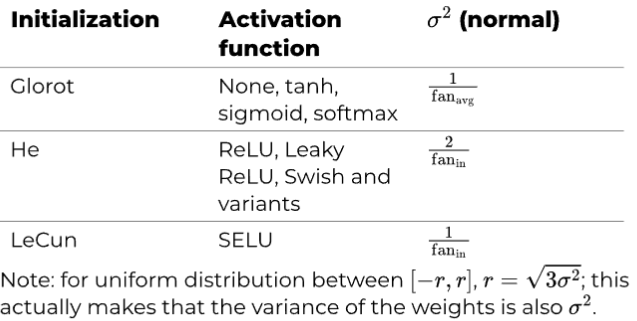
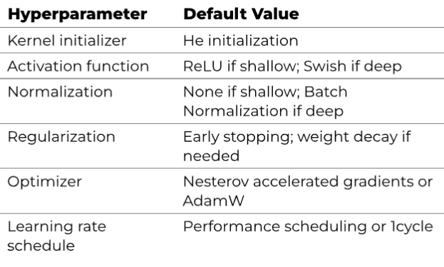
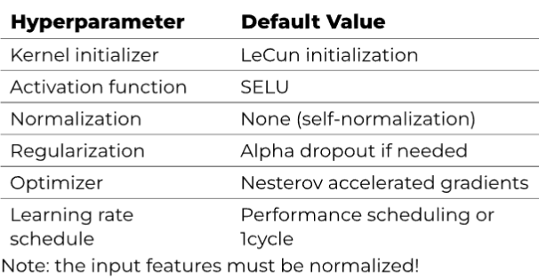

# H11: Training Deep Neural Networks

## Problems with training a DNN

- Gradients grow smaller / larger during backpropagation
- Not enough training data
- Training is slow
- Overfitting if model has too many parameters

### 11.1 Vanishing/Exploding Gradients Problem

The problem:

- Gradients get smaller and smaller as the backpropagation algorithm progresses down to the lower layers = Vanishing Gradients
- => Lower layers have very small gradients => they get hardly updated during training
- Sigmoid activation function saturation causes the gradients to be very small
- Sometimes the gradients get larger and larger = Exploding Gradients (Typically in RNNs)

#### 11.1.1 Glorot and He Initialization

- Initialization strategy for connection weights -> significant impact on speed of convergence



#### 11.1.2 Better Activation Functions

`Leaky ReLU` activation function:

- ReLU: problem of dying neurons (neurons that output 0 for every input)
- Leaky ReLU: $\text{LeakyReLU}_\alpha(z) = \max(\alpha z, z)$ = $\begin{cases} \alpha z & \text{if } z < 0 \\ z & \text{if } z \geq 0 \end{cases}$ with $\alpha$ $>$ 0
- With Leaky ReLU, the neurons in a deep network won't die during training (may be in "coma" but have a chance to wake up)
- Use He initialization for Leaky ReLU ("he_normal")

`Swish` activation function:

- Swish: $\text{Swish}_\beta(z) = z \cdot \text{sigmoid}(\beta z)$
- activation = "swish" (TensorFlow)

`When use which activation function?`:

- ReLU is a good default
- Complex tasks: Swish or Leaky ReLU (if you care about runtime latency)

#### 11.1.3 Batch Normalization

`What`

- Vanishing/exploding gradients problem is solved by using better weight initialization and better activation functions
- But they can come back during training
- Batch Normalization solves this problem

`How`

- Add an operation in the model just before or after the activation function of each hidden layer
  - Zero-center and normalize each input
  - Scale and shift result
  - i.e. lets model learn optimal scale and mean of each of the layer's inputs

`Formulas` 

???

`BN at Test/Inference Time`

- When testing -> no mini-batches to compute empirical mean and standard deviation
- Solution: during training estimates for mean and standard deviation are computed
- Exponential moving average of these estimates kept track of during training => `Non learnable parameters` of the BN layer

`Benefits`

- vanaishing/exploding gradients problem stronlgy reduced
- Networks less senseitive to weight initialization
- Much larger learning rates can be used -> faster learning
- BN acts like a regularizer -> reducing need for other regularization techniques

`Disadvantages`

- Adds complexity to model (also different behavior during training and testing)
- Slower predictions (because of extra computations required at each layer)

`use_bias=False in Dense layers`

- BN layer has its own biases (learnable parameters $\beta$ and $\gamma$) -> no need to add bias term in previous layer

`Hyperparameters of BN`

- axis: which axis to normalize
  - axis=-1: last axis (default)
  - if batchshape = (batch_size, features) -> each feature normalized independently
  - if batchshape = (batch_size, height, width) -> by default width means and variances
    - Normalize each pixel independently -> axis=[1,2]

#### 11.1.4 Gradient Clipping

- Technique to prevent exploding gradients in RNNs
- Passing `clipvalue=1.0` to optimizer -> every component of gradient vector clipped between -1.0 and 1.0
  - May change direction of gradient
- Instead passing `clipnorm=1.0` -> clip norm of gradient to 1.0
  - Preserves direction of gradient

### 11.2 Reusing Pretrained Layers

- Transfer learning: reuse parts of a pretrained neural network
- Replace output layer of pretrained network with new one

1. Freeze all layers of pretrained model (weights won't be updated during training)
2. Unfreeze some of the reused layers
   1. to modify during training
   2. small learning rate to avoid wrecking the reused weights

`Implementation`

!! Compile model after freezing/unfreezing layers

### 11.5 Avoiding Overfitting Through Regularization

- Many parameters in DNN -> risk of overfitting
- Use regularization techniques:
  - Early stopping
  - L1 and L2 regularization
  - Dropout
  - Max-norm regularization
  - Data augmentation

#### 11.5.1 l1 and l2 Regularization

- Add regularization term to cost function
- tf.keras.regularizers.l1 or .l2 or .l1_l2
- Don't use Adam optimizer -> use AdamW instead

#### 11.5.2 Dropout

- Simple: at every training step, every neuron (including input neurons, but always excluding output neurons) has a probability p of being temporarily "dropped out" (meaning it will be entirely ignored during this training step, but it may be active during the next step)
- Typically p = between 10% and 50% 
- When overfitting -> increase dropout rate and vice versa
- To check for overfitting -> check both training loss and validation loss without dropout

#### 11.5.3 Monte Carlo (MC) Dropout

- Dropout is only active during training -> can't use it to estimate uncertainty of predictions
- MC Dropout: use dropout at test time as well
  - Make predictions multiple times for each instance -> get different outputs
  - Compute mean and standard deviation of these predictions
  - Standard deviation = measure of uncertainty of predictions
- Advanced implementation:

```python
class MCDropout(keras.layers.Dropout):
    def call(self, inputs):
        return super().call(inputs, training=True)

Dropout = tf.keras.layers.Dropout
mc_model = tf.keras.Sequential([
    MCDropout(layer.rate) if isinstance(layer, Dropout) else layer
    for layer in model.layers
])
```

## 11.6 Summary + practical guidelines





`Exceptions to the above`

- For sparse models -> use l1 regularization
- For low-latency models -> fewer layers, fast activation functions (e.g. ReLU), fold batch-norm layers into previous layers after training
- For Risk-sensitive applications -> MC Dropout
