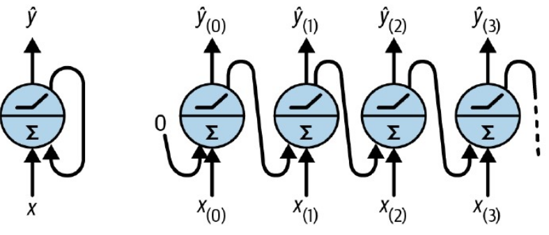
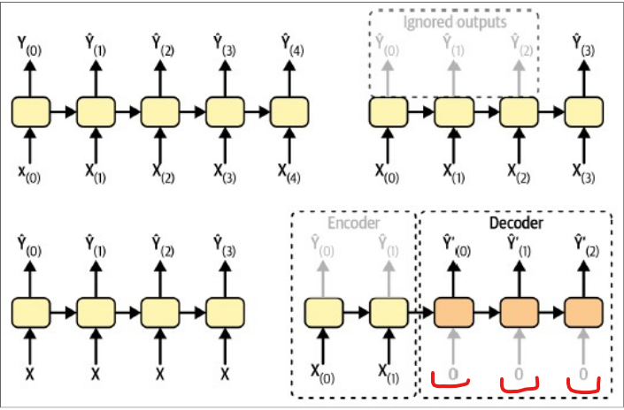
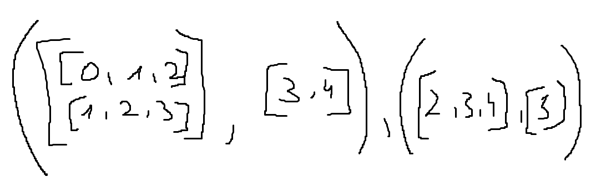
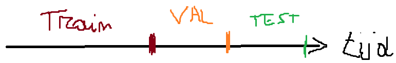

# Sequenties

## Fully Connected netwerk

- Enkel inputs van vaste grootte
- Geen parameter deling (als in sharing) (iets wordt ontdekt op bepaalde plaats -> moet opnieuw ontdekt worden op andere plaats)

## Recursive Neural Networks

- Sequenties behandelen van willekeurige lengte
- Voorbeeld van sequenciele data:
  - geluid
  - text
  - tijdsreeksen

- 2 problemen:
  - onstabiele gradient
  - beperkt geheugen over lange termijn (moeilijk om iets te onthouden over lange termijn)

### 15.1 Recurrente laag



- x0 ------> y0
- x1 --y0--> y1 (y0 wordt meegegeven)
- x2 --y1--> y2 (y1 wordt meegegeven)

- Dus: y(t) = f(x(t), y(t-1))
  - = f(x(t), f(x(t-1), y(t-2)))
  - = f(x(t), f(x(t-1), f(x(t-2), y(t-3))))

- --> y(t) hangt af van x0, x1, ..., xt

```Mathematica
Y(t) met Y = tensor met batchsize, etc...

activatie_functie = tanh typisch

Y(t) = activatie_functie( X(t)Wx + Y(t-1)Wy + b )

X(t) --> (batch, #inputs)
Wx --> (#inputs, #outputs)
Y(t-1) --> (batch, #outputs)
Wy --> (#outputs, #outputs)
b --> (#outputs)
```

#### 15.1.2 Different modes of use for RNN's

EXAMEN!
kunnen onderscheiden + voorbeeld + leg kort uit hoe het werkt



- Rechtsboven:
  - input = sequence (vb. review)
  - output = vector (vb. positief of negatief)
  - sequence to vector

- Linksboven:
  - input = sequence (evenlang als output) (voorbeeld #mensen die bus nemen)
  - output = sequence (evenlang als input) (voorbeeld #mensen die bus nemen per dag)
  - sequence to sequence

- Rechtsonder:
  - encoder/decoder model
  - input = sequence (vb. engelse zin) (encoder, negeer output, onthoud hidden state)
  - output = sequence (vb. franse zin) (decoder, gebruik hidden state van encoder)
  - sequence to sequence (input en output lengte kunnen/mogen verschillen)
  - rood => niet altijd nul... (vereenvoudigde voorstelling)

- Linksonder:
  - input = vector (vb. afbeelding)
  - output = sequence (vb. onderschrift)
  - vector to sequence

### 15.2 Training RNN's

- Backpropagation through time (niet super belangrijk voor examen)

### 15.3 Forecasten mbv RNN's

- Tijdsreeksen : data op opeenvolgende tijdstippen
  - univariate tijdsreeksen : 1 variabele
  - multivariate tijdsreeksen : meerdere variabelen

- Forecasten : voorspellen van toekomstige waarden => veel verschillende manieren
  - naief : voorspel de laatst gekende zinvolle waarde (vb. temperatuur: voorspel hoe warm het morgen is om dit tijdstip nu -> temperatuur van nu als voorspelling)
  - statistische modellen: ARIMA, ... (niet te kennen)
  - RNN's

- Metrieken (niet gebonden aan alleen tijdsreeksen)
  - Mean Squared Error (MSE)
  - Mean Absolute Error (MAE)
  - Mean Absolute Percentage Error (MAPE)

#### 15.3.2 Data voorbereiden

- Gegeven: t-55, ... t-1, t => voorspel t+1

- Ingebouwde tensorflowfunctie:

  - tf.keras.utils.timeseries_dataset_from_array(data, targets, sequence_length)
    - data = [0, 1, 2, 3, 4, 5]
    - sequence_length = 3
    - sequence1 = [0, 1, 2] - targets = [3]
    - sequence2 = [1, 2, 3] - targets = [4]
    - sequence3 = [2, 3, 4] - targets = [5]
    - targets = [3, 4, 5]

    - batch_size = 2
    - 
  
  - tf.data.Dataset.range(6).window(4, shift=1)
    - [0 1 2 3]
    - [1 2 3 4]
    - [2 3 4 5]
    - [3 4 5] -> drop_remainder=True (dan valt deze weg)
    - [4 5] -> drop_remainder=True (dan valt deze weg)
    - [5] -> drop_remainder=True (dan valt deze weg)
    - nu hebben we een dataset van datasets -> we willen een dataset van tensors

  - tf.data.Dataset.range(6).window(4, shift=1).flat_map(lambda window: window.batch(4))
    - [0 1 2 3], [1 2 3 4], [2 3 4 5]

  - tf.data.Dataset.range(6).window(4, shift=1).flat_map(lambda window: window.batch(4)).map(lambda window: (window[:-1], window[-1:]))
    - ([0 1 2], [3]), ([1 2 3], [4]), ([2 3 4], [5])

  - Train / test / val data
    - random split van data -> verlies volgorde van tijdsreeks -> niet goed
    - gebruik niet geshuffeld deel als train, val, test => kunnen uitleggen op EXAMEN
    - 

#### 15.3.3 Model maken

- tf.keras.Sequential([tf.keras.layers.SimpleRNN(units=1, input_shape=(None, num_features))])
  - num_features => bij voorspellen hoeveel mensen bus zullen nemen: 1
  - None => lengte van de sequentie moet willekeurige lengte kunnen hebben
  - => Slecht model: 3 parameters is te weinig, default activatie is tanh (-1, 1) maar onze data ligt tussen (0, 1.4)
  - Oplossing => meer units (vb. 32) => Dense laag nodig die 32 omzet naar 1 (dus Denselaag met 1 neuron)
  