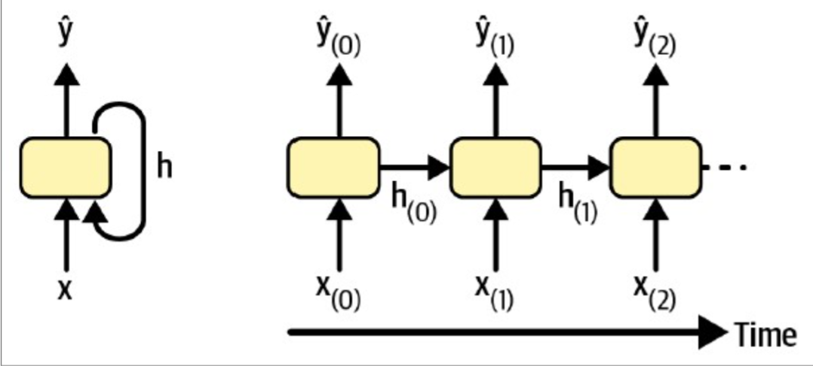
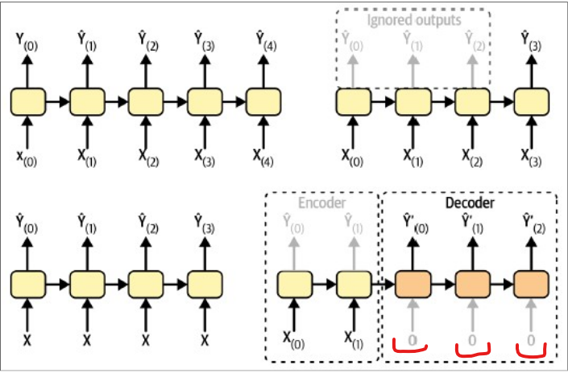

# H15: Processing Sequences Using RNNs and CNNs

`Recurrent Neural Network (RNN)`:

- Sequenties behandelen van willekeurige lengte
- Voorbeeld van sequenciele data:
  - geluid
  - text
  - tijdsreeksen

- 2 problemen:
  - `Unstable gradients` -> solved with `Recurrent Dropout` and `Recurrent Layer Normalization`
  - beperkt geheugen over lange termijn (moeilijk om iets te onthouden over lange termijn) -> solved with `LSTM` and `GRU`

## 15.1 Recurrent Neurons and Layers


- `Recurrent layer` = layer of recurrent neurons
- each time step t, neuron receives both the input vector x(t) and the output vector from the previous time step y(t-1)
- each recurrent neuron has two sets of weights: one for the inputs x(t) and the other for the outputs of the previous time step y(t-1)
- Unrolled through time

### Computation of a Recurrent Layer

$\hat{Y}_{(t)} = \phi(X_{(t)} \cdot W_{x} + \hat{Y}_{(t-1)} \cdot W_{\hat{y}} + b)$

- $\hat{Y}_{(t)}$ = output vector of the recurrent layer at time step $t$
- $\phi$ = activation function (typically tanh)
- $X_{(t)}$ = input batch at time step $t$
- $W_{x}$ (n_inputs x n_neurons) = weight matrix for inputs of current time step
- $W_{\hat{y}}$ (n_neurons x n_neurons) = weight matrix for outputs of previous time step
- $b$ = bias vector of size $n_{neurons}$

Notice:

- $\hat{Y}_{(t)}$ is a function of $X_{(t)}$ and $\hat{Y}_{(t-1)}$
- $\hat{Y}_{(t-1)}$ is a function of $X_{(t-1)}$ and $\hat{Y}_{(t-2)}$
- $\hat{Y}_{(t-2)}$ is a function of $X_{(t-2)}$ and $\hat{Y}_{(t-3)}$
- Etc...

I.e. $\hat{Y}_{(t)}$ is a function of all inputs from time step 0 to $t$

### Memory Cells

- Since output of recurrent neuron depends on all previous inputs -> has some form of `memory`
- A cel may have a Hidden state $h_t$
  - Output $h_t$ (or $y_t$) $= f(x_t, h_{t-1})$

Ouput may differ from state:



#### 15.1.2 Different modes of use for RNN's

EXAMEN!
kunnen onderscheiden + voorbeeld + leg kort uit hoe het werkt



- Rechtsboven:
  - input = sequence (movie review)
  - output = vector (positief of negatief)
  - E.g. sentiment analysis of a movie review
  - `sequence to vector`

- Linksboven:
  - input = sequence (voorbeeld #mensen die bus nemen)
  - output = sequence (voorbeeld #mensen die bus nemen per dag)
  - E.g. time series forecasting
  - `sequence to sequence` (`input en output zijn evenlang`)

- Rechtsonder:
  - `encoder/decoder` model -> `sequence to vector` + `vector to sequence`
  - input = sequence (vb. engelse zin) (encoder, negeer output, onthoud hidden state)
  - output = sequence (vb. franse zin) (decoder, gebruik hidden state van encoder)
  - `sequence to sequence` (`input en output lengte kunnen/mogen verschillen`)
  - E.g. machine translation
  - Note: rood op figuur => niet altijd nul... (vereenvoudigde voorstelling)

- Linksonder:
  - input = vector (vb. afbeelding)
  - output = sequence (vb. onderschrift)
  - E.g. image captioning
  - `vector to sequence`

## 15.2 Training RNN's (Achtergrond informatie)

- `Backpropagation through time (BPTT)` = Backpropagation algorithm generealized to handle sequences

## 15.3 Forecasting a Time Series

- Tijdsreeksen : data op opeenvolgende tijdstippen
  - univariate tijdsreeksen : 1 variabele per tijdstip
  - multivariate tijdsreeksen : meerdere variabelen per tijdstip

- Forecasten : voorspellen van toekomstige waarden => veel verschillende manieren
  - naief : voorspel de laatst gekende zinvolle waarde (vb. temperatuur: voorspel hoe warm het morgen is om dit tijdstip nu -> temperatuur van nu als voorspelling)
  - RNN's

- Metrieken (niet gebonden aan alleen tijdsreeksen)
  - Mean Squared Error (MSE)
  - Mean Absolute Error (MAE)
  - Mean Absolute Percentage Error (MAPE) -> easier to interpret than MAE

### 15.3.2 Data voorbereiden

- Gegeven: t-55, ... t-1, t => voorspel t+1- Ingebouwde tensorflowfunctie:

  - tf.keras.utils.timeseries_dataset_from_array(data, targets, sequence_length)
    - data = [0, 1, 2, 3, 4, 5]
    - sequence_length = 3
    - sequence1 = [0, 1, 2] - targets = [3]
    - sequence2 = [1, 2, 3] - targets = [4]
    - sequence3 = [2, 3, 4] - targets = [5]
    - targets = [3, 4, 5] (data[sequence_length:])

    - batch_size = 2
    - 
  
  - tf.data.Dataset.range(6).window(4, shift=1)
    - [0 1 2 3]
    - [1 2 3 4]
    - [2 3 4 5]
    - [3 4 5] -> drop_remainder=True (dan valt deze weg)
    - [4 5] -> drop_remainder=True (dan valt deze weg)
    - [5] -> drop_remainder=True (dan valt deze weg)
    - nu hebben we een dataset van datasets -> we willen een dataset van tensors

  - tf.data.Dataset.range(6).window(4, shift=1).flat_map(lambda window: window.batch(4))
    - [0 1 2 3], [1 2 3 4], [2 3 4 5]

  - tf.data.Dataset.range(6).window(4, shift=1).flat_map(lambda window: window.batch(4)).map(lambda window: (window[:-1], window[-1:]))
    - ([0 1 2], [3]), ([1 2 3], [4]), ([2 3 4], [5])

  - Train / test / val data
    - random split van data -> verlies volgorde van tijdsreeks -> niet goed
    - gebruik niet geshuffeld deel als train, val, test => kunnen uitleggen op EXAMEN
    - 

#### 15.3.3 Model maken

`SimpleRNN`

```Python
tf.keras.Sequential([tf.keras.layers.SimpleRNN(units=1, input_shape=(None, num_features))])
```

- `return_sequences=True` => output van elke tijdstap
- activation = tanh by default
- num_features => bij voorspellen hoeveel mensen bus zullen nemen: 1
- None => lengte van de sequentie moet willekeurige lengte kunnen hebben
- => Slecht model: 3 parameters is te weinig, default activatie is tanh (-1, 1) maar onze data ligt tussen (0, 1.4)
- Oplossing => meer units (vb. 32) => Dense laag nodig die 32 omzet naar 1 (dus Denselaag met 1 neuron)

```Python
tf.keras.Sequential([
    tf.keras.layers.SimpleRNN(units=32, return_sequences=True, input_shape=[None, 5]),
    tf.keras.layers.Dense(units=14)
])
```

`TimeDistributed layer`

- `TimeDistributed` layer => voer Dense layer uit op elke tijdstap
- `tf.keras.layers.TimeDistributed(tf.keras.layers.Dense(14))`
- If input in Dense = (batch_size, d0, d1) => output = (batch_size, d0, units)
- with d0 = number of timesteps, d1 = number of features per timestep

`Conv1D layer instead of Dense layer`

- `tf.keras.layers.Conv1D(filters=14, kernel_size=1)`
- Dense layer has 32x14+14 = 462 parameters
- Conv1D layer computes convolution over single (time) dimension
  - kernel_size = number of time stepts to look at
  - filters = number of output channels
  - kernel=1, filters=14 => 32x1x14+14 = 462 parameters
  - Identical result as Dense layer

## 15.4 Handling Long Sequences

- When training RNN on long sequences
  - -> unstable gradients
  - -> memory loss (`short-term memory problem`)

### 15.4.1 Unstable Gradients

Fix:

- Good parameter initialization
- Faster optimizers
- Dropout

Nonsaturating activation functions like ReLU -> not helpfull -> tanh default for RNNs

Batch Normalization -> not helpfull -> RNNs have only one input at a time

=> `Layer Normalization` -> works well with RNNs

- `tf.keras.layers.LayerNormalization()`
- normalize across features dimension instead of batch dimension
- same behavior during training and testing
- Layer norm learns offset and scale for each input feature
- In RNN: typically applied after linear combination of inputs and hidden states, before activation function

### 15.4.2 Long-Term Memory Problem

`Long Short-Term Memory (LSTM)` `Gated Recurrent Unit (GRU)`

- Both better at handling long sequences than a plain RNN (But still trouble with very long sequences)

#### Long Short-Term Memory (LSTM)

- State:
  - $h_{(t)}$ = short-term state
  - $c_{(t)}$ = long-term state

- Input:
  - $x_{(t)}$ = input vector
  - $h_{(t-1)}$ = short-term state from previous time step
  - $c_{(t-1)}$ = long-term state from previous time step

- Output:
  - for time step $t$ -> $\hat{y}_{(t)}$
  - Both state vectors $h_{(t)}$ and $c_{(t)}$

- All 3 vectors $x_{(t)}$, $h_{(t)}$ and $c_{(t)}$ have same number of components defined at creation of LSTM cell

##### Computations


- 4 fully connected layers
- Each takes current input $x_{(t)}$ with (batch_size, num_features) & previous short-term state $h_{(t-1)}$ with (batch_size, units) as inputs
  - $x_{(t)}$ is concatenated with $h_{(t-1)}$ -> (batch_size, num_features + units)
  - each of 4 layers has units neurons
  - $f, i$ and $o$ -> sigmoid activation
  - $g$ -> tanh activation

- Each time step:
  - $h_{t-1} and $c_{t-1} extracted from the state
  - 4 layers applied to concatenation of $x_{(t)}$ and $h_{(t-1)}$
    - to yield $f_{(t)}$, $i_{(t)}$, $o_{(t)}$ and $g_{(t)}$
    - each of size (batch_size, units)

- New long-term state $c_{(t)}$ = $f_{(t)} \cdot c_{(t-1)} + i_{(t)} \cdot g_{(t)}$
- New short-term state $h_{(t)}$ = $o_{(t)} \cdot tanh(c_{(t)})$
- New output $\hat{y}_{(t)}$ = $h_{(t)}$

#### Gated Recurrent Unit (GRU)

- Simpliefied version of LSTM
  - only single state vector $h_{t}$
  - fewer "gates" inside cell

#### Using 1D Convolutional Layers to Process Sequences

- 1D conv layer slides several kernels across sequence -> 1D feature map per kernel
- can be used to process sequences
- can be used in combination with RNNs

#### WaveNet

- Architecture to process very long sequences
- Large stack of Conv1D layers
- Each ConvLayer -> `dilation rate` double of previous layer
- `Causal padding` -> ensure network can't look in future
  - same as "same" padding, but only padding on left side


```Python
model = keras.models.Sequential()
model.add(keras.layers.InputLayer(input_shape=[None, 5]))

for rate in (1, 2, 4, 8) * 2:
    model.add(keras.layers.Conv1D(filters=32, kernel_size=2, padding="causal", activation="relu", dilation_rate=rate))

model.add(keras.layers.Conv1D(filters=14, kernel_size=1))
```
